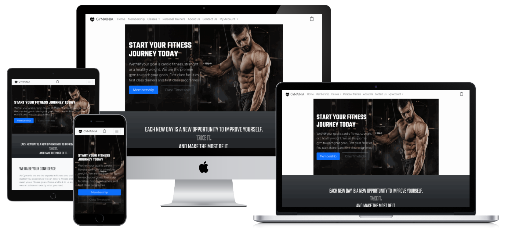

<h1 align="center">Gymania</h1>

[View the live project here.](https://gymania-live.herokuapp.com/)

The goal of this website is to promote the fitness centre Gymania and allow its customers to see up and coming fitness classes. The website also allows the booking of the classes.

### Features
* See the important information about Gymania
* View the trainers bios
* View teh classes available
* See the classes timetables
* Book a class and pay online
* View your membership profile and purchased classes


### Features to implement
* membership could also be purchsed

## User Experience (UX)

### User stories

#### First Time Visitor Goals
- As a first time visitor I want to quickly understand what the webite is
- As a first time visitor I want to be able see the main features
- As a first time visitor I want to be able to quickly book a class

#### Frequent User Goals
- As a Frequent User, I want to able to see my membership details and classes booked

### Wireframes

<h2 align="center"></h2>

## Design
The app was designed be clean and the main goal of converting new customers standout.

## Technologies Used

### Languages Used

- [HTML5](https://en.wikipedia.org/wiki/HTML5)
- [CSS3](https://en.wikipedia.org/wiki/Cascading_Style_Sheets)
- [Javascript](https://en.wikipedia.org/wiki/Cascading_Style_Sheets)
- [Python](https://www.python.org/)

### Frameworks, Libraries & Programs Used

1. [Google Fonts:](https://fonts.google.com/)
    - Google fonts were used to import the 'Asap' and 'Roboto' font into the style.css file which is used on all pages throughout the project.
1. [jQuery:](https://jquery.com/)
    - jQuery came with Bootstrap to make the navbar responsive but was also used for the smooth scroll function in JavaScript.
1. [Git](https://git-scm.com/)
    - Git was used for version control by utilizing the Gitpod terminal to commit to Git and Push to GitHub.
1. [GitHub:](https://github.com/)
    - GitHub is used to store the projects code after being pushed from Git.
1. [Photoshop:](https://www.adobe.com/ie/products/photoshop.html)
    - Photoshop was used to create the logo, resizing images and editing photos for the website.
1. [Django:](https://django.com/)
    - Python Flask was used as the Framework
1. [AWS:](https://aws.amazon.com)
    - Used for testing routes
1. [Heroku:](https://heroku.com/)
    - MongoDB was used as the database and Pymongo was used as the Python interface
1. [Bootstrap:](https://getbootstrap.com/)
    - Bootstrap was used and the html foundation

## Testing

The W3C Markup Validator and W3C CSS Validator Services were used to validate every page of the front end to ensure there were no syntax errors in the project. However testing will need to be done on the user login sections.

-   [W3C Markup Validator](https://validator.w3.org/) - [Results](https://github.com/)
-   [W3C CSS Validator](https://jigsaw.w3.org/css-validator/#validate_by_input) - [Results](https://github.com/)

The website has been tested on multiple device to ensure it is fully responsive.

Lighthouse in Chrome DevTools was used to test performance and accesibility.


### Testing User Stories from User Experience (UX) Section

First Time Visitor

- As a first time visitor I want to quickly understand what the webite is
    - Clear hero section
- As a first time visitor I want to be able see the main features
    - Main features laid out on the homepage in indvidual sections
- As a first time visitor I want to be able to quickly book a class
    - Class timetable section easily accessible from main menu

#### Frequent User Goals

- As a Frequent User, I want to able to see my membership details and classes booked
    - The user has the ability to login from the main menue and review some basic personal details and booking history

### Further Testing

- The Website was tested on all major browsers Google Chrome, Internet Explorer, Microsoft Edge and Safari.
- The website was viewed on a variety of devices such as Desktop, Laptop, iPhone7, iPhone 8 & iPhoneX.
- All links were fully tested using the tool https://www.deadlinkchecker.com/website-dead-link-checker.asp
- Friends and family members were asked to review the site and documentation to point out any bugs and/or user experience issues. 
- An issue and bug tracking form was created to capture and organise issues https://docs.google.com/forms/d/e/1FAIpQLSdNLVMxg7r8N_QqMUZTauve1_v-7IZILd-jC0k2aPuGr4pqyQ/viewform?usp=sf_link

### Known Bugs

- No know bugs have been reported

## Database schema

FlashPoll.io uses two collections, Users and Polls

Profile Schema:
```
    user = models.OneToOneField(User, on_delete=models.CASCADE)
    default_phone_number = models.CharField(max_length=20,
                                            null=True, blank=True)
    default_street_address1 = models.CharField(max_length=80,
                                               null=True, blank=True)
    default_street_address2 = models.CharField(max_length=80,
                                               null=True, blank=True)
    default_town_or_city = models.CharField(max_length=40,
                                            null=True, blank=True)
    default_county = models.CharField(max_length=80,
                                      null=True, blank=True)
    default_postcode = models.CharField(max_length=20,
                                        null=True, blank=True)
```

Class Schema:
```
    category = models.ForeignKey('Category', null=True, blank=True, on_delete=models.SET_NULL)
    name = models.CharField(max_length=254)
    description = HTMLField()
    short = models.TextField(blank=True)
    level = models.CharField(max_length=254)
    duration = models.IntegerField()
    period = models.CharField(max_length=254)
    students = models.IntegerField()
    price = models.DecimalField(max_digits=6, decimal_places=2)
    trainer = models.ManyToManyField('Trainer', blank=True)
    image_url = models.URLField(max_length=1024, null=True, blank=True)
    image = models.ImageField(null=True, blank=True)

```

Timetable Schema:
```
    gym_class = models.ForeignKey('GymClass', on_delete=models.CASCADE)
    start_date = models.DateField()
    end_date = models.DateField()
    day = models.CharField(max_length=12)
    time_slot = models.CharField(max_length=12)
    trainer = models.ForeignKey('Trainer', on_delete=models.CASCADE)

```

## Deployment

### GitHub Pages

The project was deployed to GitHub Pages using the following steps...

1. Log in to GitHub and locate the [GitHub Repository](https://github.com/)
2. At the top of the Repository (not top of page), locate the "Settings" Button on the menu.
    - Alternatively Click [Here](https://raw.githubusercontent.com/) for a GIF demonstrating the process starting from Step 2.
3. Scroll down the Settings page until you locate the "GitHub Pages" Section.
4. Under "Source", click the dropdown called "None" and select "Master Branch".
5. The page will automatically refresh.
6. Scroll back down through the page to locate the now published site [link](https://github.com) in the "GitHub Pages" section.

### Forking the GitHub Repository

By forking the GitHub Repository we make a copy of the original repository on our GitHub account to view and/or make changes without affecting the original repository by using the following steps...

1. Log in to GitHub and locate the [GitHub Repository](https://github.com/)
2. At the top of the Repository (not top of page) just above the "Settings" Button on the menu, locate the "Fork" Button.
3. You should now have a copy of the original repository in your GitHub account.

### Making a Local Clone

1. Log in to GitHub and locate the [GitHub Repository](https://github.com/)
2. Under the repository name, click "Clone or download".
3. To clone the repository using HTTPS, under "Clone with HTTPS", copy the link.
4. Open Git Bash
5. Change the current working directory to the location where you want the cloned directory to be made.
6. Type `git clone`, and then paste the URL you copied in Step 3.

```
$ git clone https://github.com/ukkpower/Backend-Development-Milestone-Project
```

7. Press Enter. Your local clone will be created.

```
$ git clone https://github.com/ukkpower/Backend-Development-Milestone-Project
> Cloning into `CI-Clone`...
> remote: Counting objects: 10, done.
> remote: Compressing objects: 100% (8/8), done.
> remove: Total 10 (delta 1), reused 10 (delta 1)
> Unpacking objects: 100% (10/10), done.
```

Click [Here](https://help.github.com/en/github/creating-cloning-and-archiving-repositories/cloning-a-repository#cloning-a-repository-to-github-desktop) to retrieve pictures for some of the buttons and more detailed explanations of the above process.

## Credits

### Images

- [Envento](https://www.envento.com/) was used for all images.

### Code

- [Code Institute](https://learn.codeinstitute.net/) was used for for checkout and user profiles.

- [Contact Form](https://www.ordinarycoders.com/blog/article/build-a-django-contact-form-with-email-backend): This tutorial was used to help with contact form help was used to copy the poll url to the users clipboard for easy sharing.